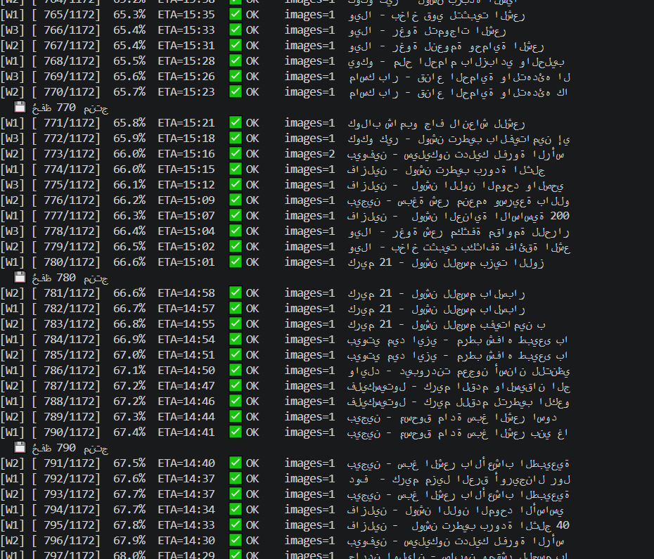
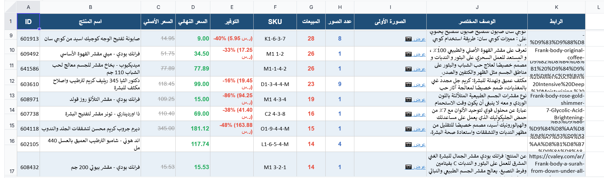

# 🛍️ Scrape Full Product Description

> استخراج البيانات الكاملة للمنتجات من المتاجر الإلكترونية مع تصنيفها في Excel احترافي بألوان جذابة

---

## 📋 نظرة عامة

مشروع متخصص في **جمع بيانات المنتجات** (الأسعار، الأوصاف، الصور) من المتاجر الإلكترونية وتحويلها إلى **تقارير Excel** منظمة وجاهزة للاستخدام.

### ✨ الميزات الرئيسية

✅ **سرعة عالية** - 3 متصفحات متوازية لسحب البيانات بسرعة 3x  
✅ **استئناف تلقائي** - توقف واستئناف من آخر منتج بدون فقدان البيانات  
✅ **دعم الأسعار المختلفة** - معالجة السعر الواحد والسعر مع خصم  
✅ **تقارير Excel احترافية** - تنسيق وألوان جذابة + حساب التوفير التلقائي  
✅ **معالجة الأخطاء** - إعادة محاولة تلقائية 3 مرات + تقرير الفاشل  

---

## 📁 بنية المشروع

```
ScrapeFullProductDescription/
├── scraper_links.py              # 🔗 استخراج روابط المنتجات
├── scraper_details.py            # 📊 سحب تفاصيل جميع المنتجات (كامل)
├── scrape_ten_product_details.py # 🧪 اختبار على 10 منتجات فقط
├── json_to_excel.py              # 📈 تحويل JSON إلى Excel بألوان
│
├── data/                          # 📁 ملفات البيانات الأصلية
│   └── products_links.json       # قائمة الروابط
│
├── tests/                         # 🧪 ملفات التجارب (اختبار الكود)
│   └── products_full_ten.json   # بيانات 10 منتجات للاختبار
│
├── results/                       # ✅ النتائج النهائية
│   ├── products_full.json        # جميع المنتجات (JSON)
│   └── products_catalog.xlsx     # الكتالوج النهائي (Excel)
│
├── requirements.txt              # 📦 المكتبات المطلوبة
├── .gitignore                    # 🚫 الملفات المستثناة من Git
└── README.md                     # 📖 هذا الملف
```

---

## 🚀 البدء السريع

### المتطلبات
- Python 3.10+
- pip (مدير المكتبات)

### التثبيت

```bash
# 1️⃣ استنساخ المشروع
git clone https://github.com/YOUR_USERNAME/ScrapeFullProductDescription.git
cd ScrapeFullProductDescription

# 2️⃣ تثبيت المكتبات
pip install -r requirements.txt

# 3️⃣ تثبيت Playwright (متصفح الويب)
playwright install chromium
```

---

## 💻 طريقة الاستخدام

### الخطوة 1️⃣: جمع روابط المنتجات
```bash
python scraper_links.py
```
**الناتج:** `data/products_links.json` (قائمة بروابط المنتجات)

### الخطوة 2️⃣: (اختياري) اختبار على 10 منتجات
```bash
python scrape_ten_product_details.py
```
**الناتج:** `tests/products_full_ten.json`

### الخطوة 3️⃣: سحب البيانات الكاملة
```bash
python scraper_details.py
```
**الناتج:** `results/products_full.json` (جميع المنتجات)  
**ملاحظة:** البرنامج يستأنف تلقائياً إذا توقف

### الخطوة 4️⃣: إنشاء ملف Excel
```bash
python json_to_excel.py
```
**الناتج:** `results/products_catalog.xlsx` (تقرير Excel جاهز)

---

## 📊 مثال على النتائج

### 🖥️ شاشة المحطة (Terminal) - تقدم السحب:

*تظهر تقدم السحب في الوقت الفعلي مع معلومات السرعة والوقت المتبقي*

---

### 📈 ملف Excel - التقرير النهائي:

*تقرير Excel احترافي مع تنسيق وألوان جذابة وحساب التوفير التلقائي*

---

### ملف JSON (بنية البيانات):
```json
{
  "id": "667067",
  "name": "دكتور ميلاكسين - أمبول تقشير",
  "price": "89",
  "regular_price": null,
  "special_price": null,
  "sku": "MLX-001",
  "sales": "145",
  "images": ["https://cdn.twsaa.com/images/..."],
  "description": "أمبول متخصص لتقشير البشرة..."
}
```

### جدول توضيحي:
| ID | اسم المنتج | السعر الأصلي | السعر النهائي | التوفير | المبيعات |
|---|---|---|---|---|---|
| 667067 | دكتور ميلاكسين | - | **89 ر.س** | - | 145 |
| 667068 | كريم الوجه | 150 | **89 ر.س** | **-41% (61 ر.س)** | 89 |

---

## ⚙️ الإعدادات

عدّل هذه الأسطر في `scraper_details.py` حسب احتياجاتك:

```python
NUM_BROWSERS = 3          # عدد المتصفحات (زيادة = سرعة أعلى)
SAVE_EVERY = 10           # احفظ النتائج كل N منتج
MAX_RETRIES = 3           # محاولات إعادة عند الفشل
PAGE_TIMEOUT = 25000      # مهلة تحميل الصفحة (ms)
DELAY_MIN = 1.5           # تأخير أدنى بين الطلبات (ثواني)
DELAY_MAX = 3.5           # تأخير أعلى بين الطلبات (ثواني)
```

---

## 📈 الميزات المتقدمة

### استئناف تلقائي
إذا توقف البرنامج:
```bash
# شغّل البرنامج مرة أخرى - سيكمل من آخر منتج
python scraper_details.py
```
البرنامج يذكر الملفات التي سحبها:
```
[RESUME] وُجد 500 منتج مسحوب مسبقاً — سيُكمل من حيث توقف
[INFO] متبقي للسحب: 671
```

### إعادة المحاولة
- 3 محاولات تلقائية عند الفشل
- تأخير متصاعد (3-6-9 ثواني)

### حفظ دوري
- يحفظ النتائج كل 10 منتجات تلقائياً
- آمن من توقف البرنامج المفاجئ

---

## 🐛 استكشاف الأخطاء

### ❌ خطأ: "الملف غير موجود"
```bash
# تأكد من أن البرنامج شغّل scraper_links.py أولاً
python scraper_links.py
```

### ❌ خطأ: "timeout" أو "connection refused"
- السيت معطل أو بطيء
- زيادة قيمة `PAGE_TIMEOUT`
- تشغيل البرنامج مرة أخرى

### ❌ خطأ: "رسالة خطأ عند فتح Excel"
- تأكد من تثبيت `openpyxl`: `pip install openpyxl`

---

## 📝 الملفات المنتجة

| الملف | الموقع | الحجم (تقريبي) | الوصف |
|---|---|---|---|
| `products_links.json` | `data/` | 50 KB | روابط المنتجات |
| `products_full_ten.json` | `tests/` | 2 MB | 10 منتجات (اختبار) |
| `products_full.json` | `results/` | 50+ MB | جميع المنتجات |
| `products_catalog.xlsx` | `results/` | 5+ MB | التقرير النهائي |

---

## 🔧 المتطلبات التقنية

```
Python         ≥ 3.10
playwright     1.43.0
beautifulsoup4 4.12.2
pandas         2.1.4
openpyxl       3.11.0
```

---

## 📜 الترخيص

هذا المشروع مرخص تحت MIT License.

---

## 👨‍💻 المساهمة

هل تريد تحسين المشروع؟
1. انسخ (fork) المستودع
2. أنشئ branch جديد (`git checkout -b feature/your-feature`)
3. commit التغييرات (`git commit -m 'Add feature'`)
4. push إلى GitHub
5. افتح Pull Request

---

## 📞 التواصل

- **GitHub:** [YahiaBR09](https://github.com/YahiaBR09)
- **Email:** yahiaberrim017@gmail.com
---

### ⭐ إذا استفدت من المشروع، لا تنسَ إضافة نجمة!

